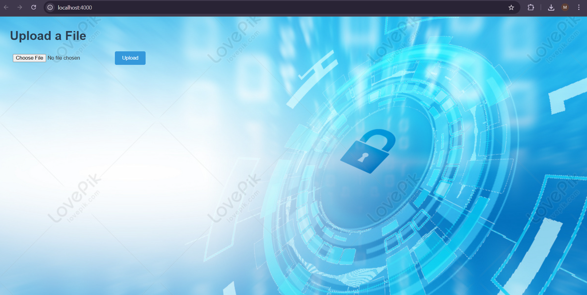

# SafeDrop
SafeDrop is a lightweight and beginner-friendly file sharing app built with Node.js and Express. It allows users to upload a file and share a temporary download link that automatically expires after a short time.

# Features
 Upload a file via a simple web form

 File auto-expires and is deleted after a set duration (e.g. 20 seconds or 24 hours)

 Expired links show a clean “link expired” message

 Built with plain HTML/CSS/JS (no frameworks)

 Easy to customize and style

# Use Cases
Quick file sharing between friends

Temporary file transfer during live sessions or demos

